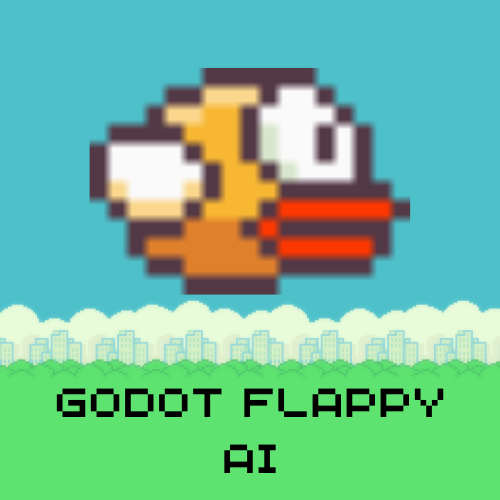

<h1>
<p align="center">
  
  <br>godot-flappy-ai
</h1>
  <p align="center">
    AI learns to play Flappy Bird using Genetic Algorithms
    <br /><br>
    
    <br />
  </p>
</p>

## Showcase
You can test it in your browser [here](https://godot-flappy-ai.netlify.app/). Note that there is a problem with how the font is exported, I guess. It shouldn't be a big deal, though.

<div align="center">
  <video src="https://github.com/user-attachments/assets/e66dd142-c4c4-4d35-bdff-870129445c6d" />
</div>


## Background
Almost 6 months ago, I got interested in genetic algorithms and the simulations people were making using them. I wanted to try it out in Flappy Bird, which was done by many people before :) At the time, I had used C++ directly and the official [godot-cpp](https://github.com/godotengine/godot-cpp/) bindings, and I hadn't touched it after that until now.

I wanted to test it out with [godot-rust/gdext](https://github.com/godot-rust/gdext) which is the Rust bindings for Godot. It was pretty great, and I was able to build for web as well, which was pretty amazing.

## Exporting to Linux, Mac, and Windows
For ordinary builds, we just need to run
```bash
cd ./rust/godot-neural-networks/ && cargo build
```
I didn't test with Mac or Windows, but it should *hopefully* be fine. Then, we need to copy the resulting `target/debug/libgodot_neural_networks.so` to the `game/extern` directory. Alternatively, you can run
```
nix build .
```
It should result in `result/lib/libgodot_neural_networks.so`, which you can copy to the `game/extern` directory and follow the Godot instructions.

## Exporting to Web
It is a bit more complex. Here's how I did it, and you can reproduce if you are a Nix user.

1. First, you will need to go to the `rust/godot-neural-networks` directory.

2. If you are using `direnv`, you are going to end up in a shell with nightly rust installed along with `emscripten` which is needed to link to `wasm32-unknown-unknown`. If you do not have a nightly rust, you can follow the instructions in [rustup.rs](https://rustup.rs).

3. Now, we need to build the wasm. If you use Nix, and therefore have the nightly rust, you can just run
```bash
cargo build -Zbuild-std=std,panic_abort --target wasm32-unknown-emscripten
```

If you are not using Nix, but have the nightly build, you should run:
```bash
rustup target add wasm32-unknown-emscripten
rustup toolchain install nightly
rustup component add rust-src --toolchain nightly
rustup target add wasm32-unknown-emscripten --toolchain nightly
cargo +nightly build -Zbuild-std --target wasm32-unknown-emscripten
```

Then, you should copy the resulting `target/wasm32-unknown-emscripten/release/libgodot_neural_networks.wasm` to the `game/extern` directory and run:
```
cd game
mkdir -v -p ../exports/web
godot --headless --verbose --export-release "Web" ../exports/web/index.html
```

## Training Process
Here is how the training process works in steps:

1. Create `num_players` random agents (*random agent* refers to an agent whose neurons' weights and biases are completely random).

2. Run the simulation and score all the agents.

3. Choose the best performing `survival_percentage` percent of the agents - they are going to survive to the next generation without any mutation.

4. Generate new agents in two distinct ways (depending on the `exploration_rate`):
    - Create a new *random agent*
    - Pick two random agents that survived from the previous generation and make a new agent out of them (*crossover*) along with some mutations.

5. Repeat the process (from step 2).

## Parameters
There are 4 parameters that are controlling the entire simulation:

1. `num_players` (default: 100): The number of agents in the simulation (birds in this context).

2. `survival_percentage` (default: 0.2): The percentage of the population that is going to survive **unmodified** to the next generation. With our default parameters, 20 agents that have performed the best will survive to the next round.

3. `mutation_probability` (default: 0.5): The probability of a gene mutating. This parameter is used to determine if a neuron's weight is going to be randomized or is going to be set using the either parents' neurons.

4. `exploration_rate` (default: 0.5): The probability of the generation of a new random agent. Once the agents that are going to survive the next round are decided, for each agent, we will poll, and see if we need to generate a completely new random agent with completely random weights.

## Deciding the Best Agents
It is a bit tricky, but the way we handle depends on two things:

1. `score`: The score of the agent in the current round/generation.

2. `collective_score`: The sum of the scores of the agents in all the previous generations.

We prioritize `score` over `collective_score`. You can see in the [source code](https://github.com/yunusey/godot-flappy-ai/blob/dd04b5b0f999bf0bb1757eb7fa3f890adf5f8b4a/rust/godot-neural-networks/src/agent.rs#L50C1-L54C2) how the comparison is held:
```rust
impl Ord for Agent {
    fn cmp(&self, other: &Self) -> std::cmp::Ordering {
        (self.score, self.collective_score).cmp(&(other.score, other.collective_score))
    }
}
```

However, I think this comparison is far from optimal... the newer agents are less likely to survive the next round even though they are better compared to the older ones.

## References
- [godot-rust/gdext](https://github.com/godot-rust/gdext)
- [Flappy Bird Assets](https://kosresetr55.itch.io/flappy-bird-assets-by-kosresetr55)
- [Flappy Bird Font](https://www.dafont.com/origami-mommy.font)
